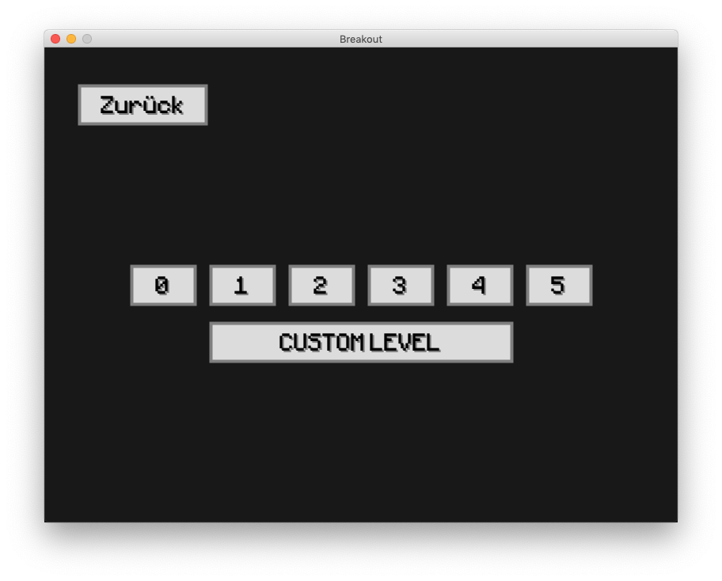

# Spielbeschreibung

Breakout v1.1 von Christian Schliz und Paul Schmitz

## Hauptmenü

Von hier aus können sie entweder das normale Spiel starten oder den Demo-Modus anzeigen lassen, der alle Elemente des Spiels zeigt:

## Das Spielfeld

Das Spielfeld besteht aus 9 x 5 Blöcken. Am unteren Bildschirmrand ist ein Paddel, welches man mit den Pfeiltasten rechts und links
entlang der x-Achse bewegen kann. Unten links wird der aktuelle Score angezeigt, unten rechts die Anzahl der Leben.

### Normale Blöcke

Die grauen Blöcke verhalten sich ganz normal, an ihnen prallt der Ball ab und zerstört sie.

### Unzerstörbare Blöcke

Die blauen Blöcke verschwinden beim auftreffen nicht, sie müssen allerdings nicht zerstört werden, um das Level zu beenden.

### Harte Blöcke

Die roten Blöcke müssen drei mal getroffen werden, um vollständig zu verschwinden. 
Nach dem ersten Treffer werden diese gelb, nach dem zweiten grün.

### Spezial-Blöcke

Trifft man einen goldenen Spezialblock, passiert eine der folgenden Aktionen:

    1. Der Ball geht in Flammen auf und zerstört so lange alles was sich in seinen Weg stellt, bis er wieder das Paddel trfft
    2. Das Paddel wird für 10 Sekunden doppelt so groß
    3. Der Spieler erhält für 10 Sekunden doppelte Punkte
    4. Der Spieler erhält ein weiters Leben
    
## Ende des Spiels

Das Spiel ist dann beendet, wenn der Spieler alle zerstörbaren Blöcke zerstört oder alle seine Leben verloren hat.
Die drei besten Ergebnisse werden in einer Bestenliste angezeigt:

## Levelauswahl

Drückt man „Spiel starten“ im Hauptmenü, erscheint die Levelauswahl:

### Eigene Level

Das Spiel enthält sechs vorgefertigte Level, der Spieler kann aber auch seine eigenen erstellen. Dazu muss
die Datei `custom.json` im Sketch-Ordner bearbeitet (oder erstellt) werden. Den richtigen Pfad findet man, wenn
man im Anleitungs-Menü auf das Fragezeichen klickt. Die `custom.json` Datei muss folgende Struktur haben:

    {
      difficulty: 0,
      size: [5, 9],
      data: [
        [0, 0, 0, 0, 0, 0, 0, 0, 0],
        [0, 0, 0, 0, 0, 0, 0, 0, 0],
        [0, 0, 0, 0, 0, 0, 0, 0, 0],
        [0, 0, 0, 0, 0, 0, 0, 0, 0],
        [0, 0, 0, 0, 0, 0, 0, 0, 0]
      ]
    }

Das zweidimensionale Array `data` ist ein Abbild des Spielfelds. Die Zahlen stehen für:

    0: Normaler Block
    1: Unzerstörbarer Block
    2: Harter Block
    3: Spezial - Feuerball
    4: Spezial - großes Paddel
    5: Spezial - doppelte Punkte
    6: Spezial - zusätzliches Leben
    
Gespielt werden kann das eigene Level durch den Button `CUSTOM LEVEL` in der Levelauswahl.
